# System Usage Monitor

- Idle

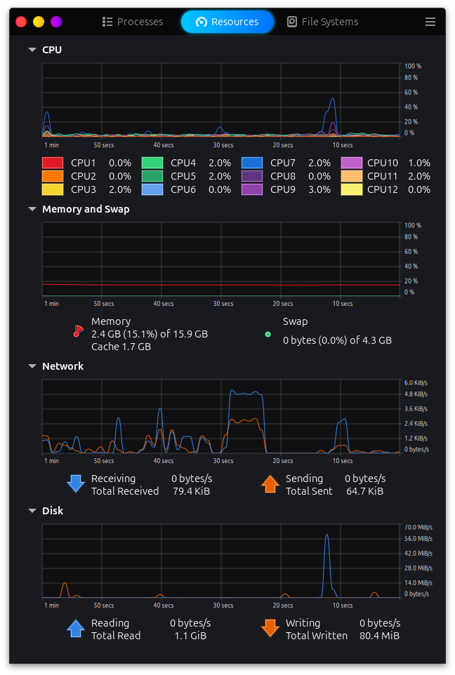

### Classical Machine Learning

#### Feature Extraction

- Train Set

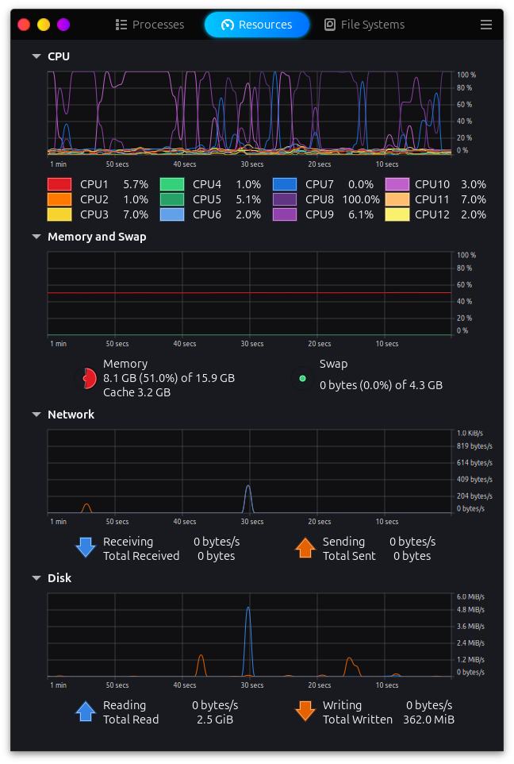

- Test Set

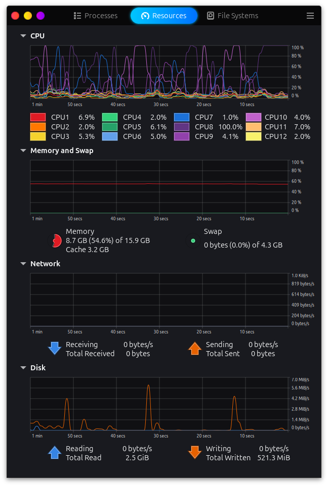

#### Modelling

- K-Nearest Neighbors

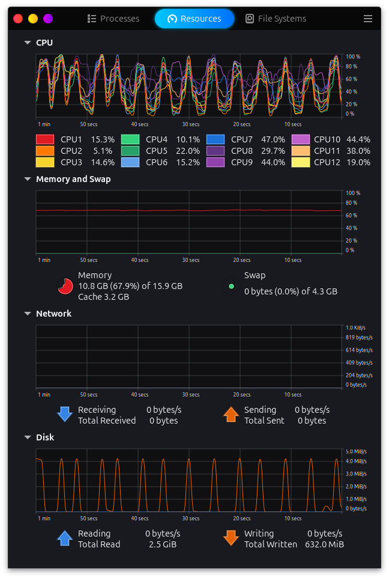

- Decision Tree

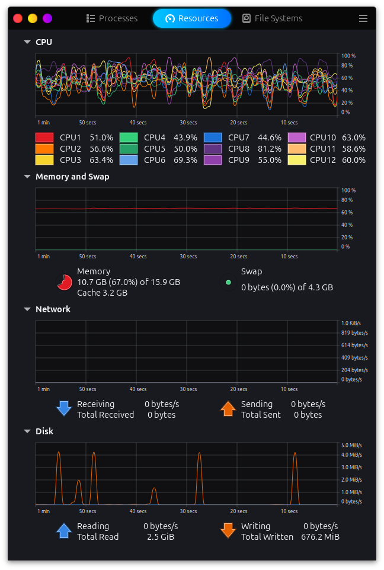

- Random Forest

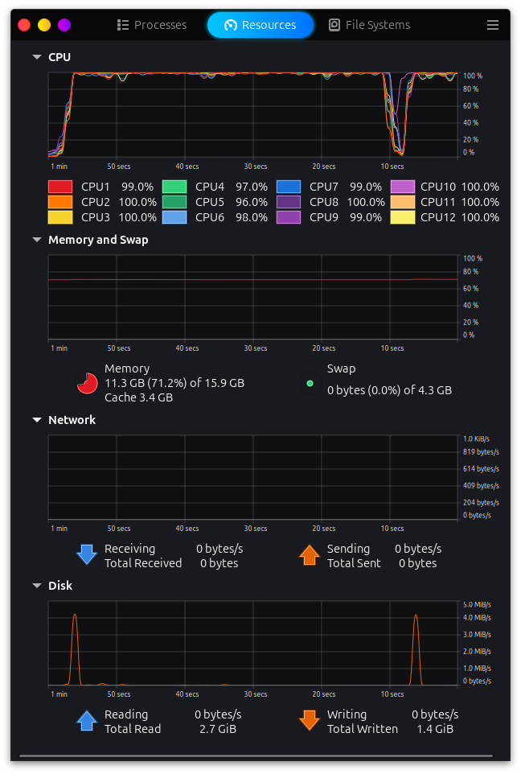

- Naive Bayes

Multinomial (Half-Left) & Gaussian (Half-Right)

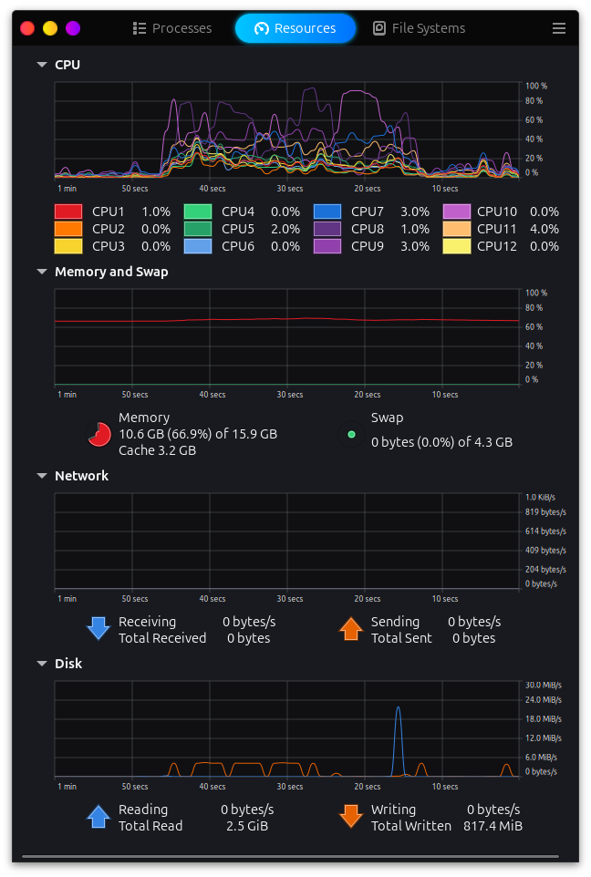

- SVM: LinearSVC

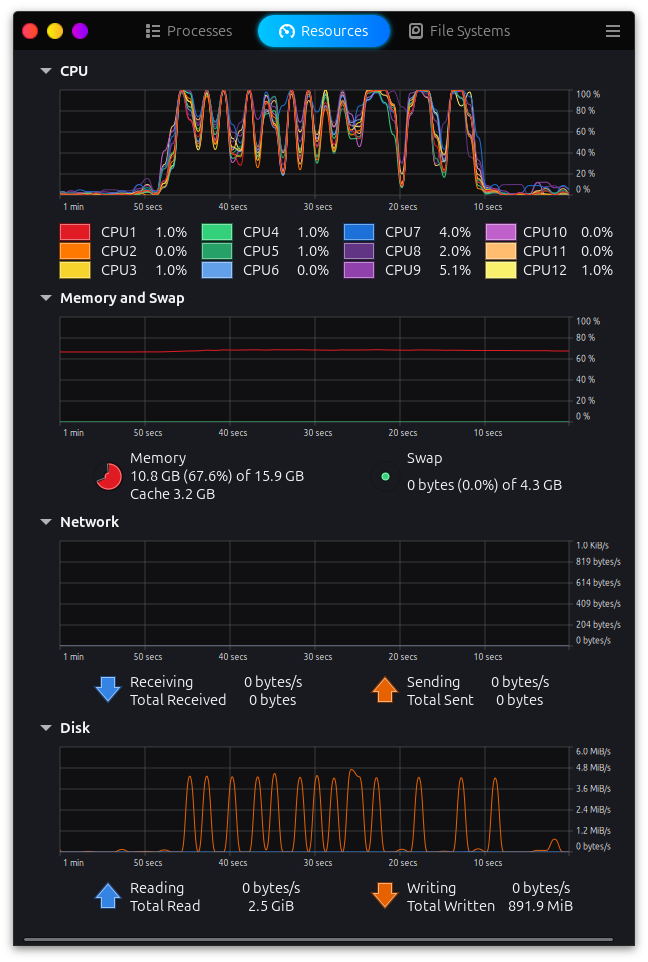

- SVM: Linear (SVC)

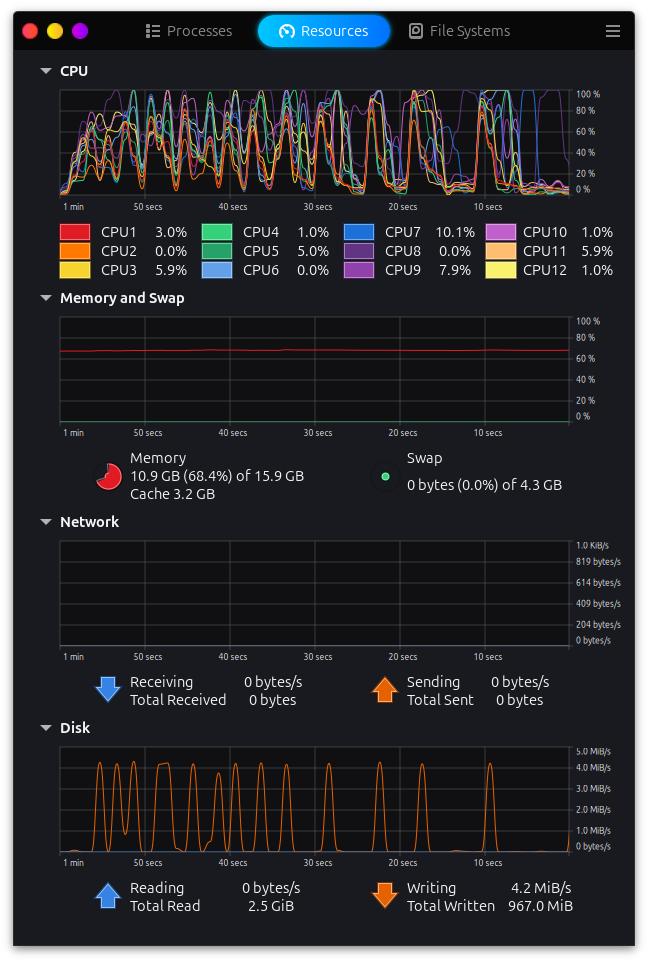

- SVM: Polynomial

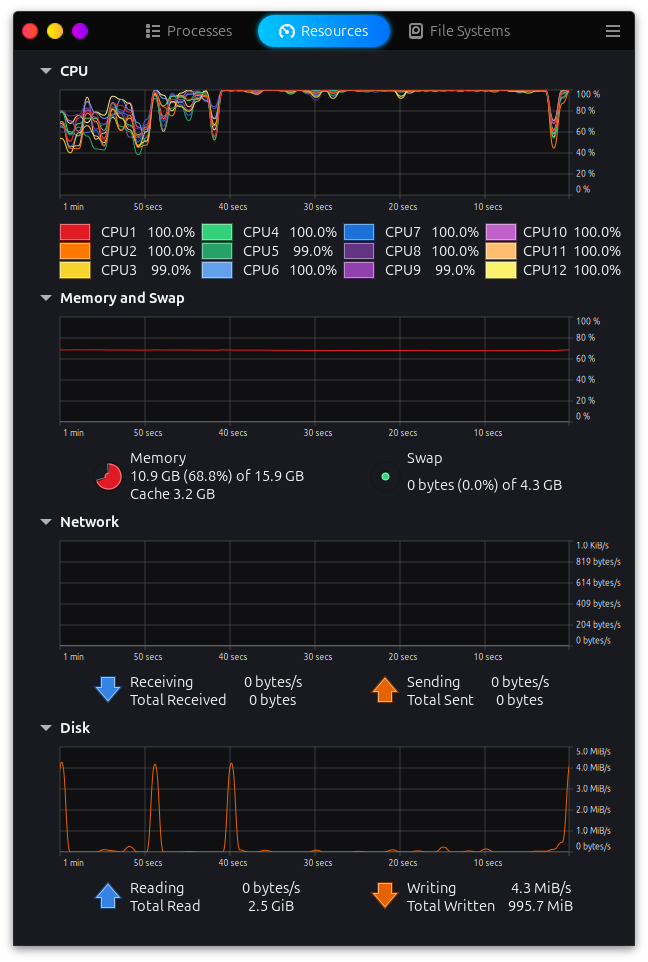

- SVM: Sigmoid

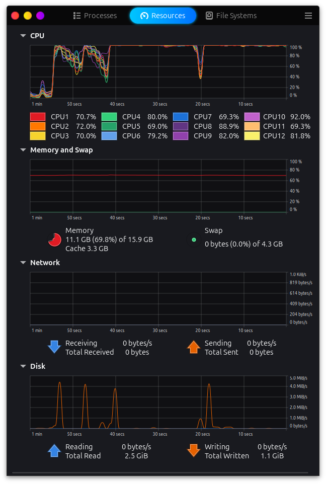

- SVM: RBF

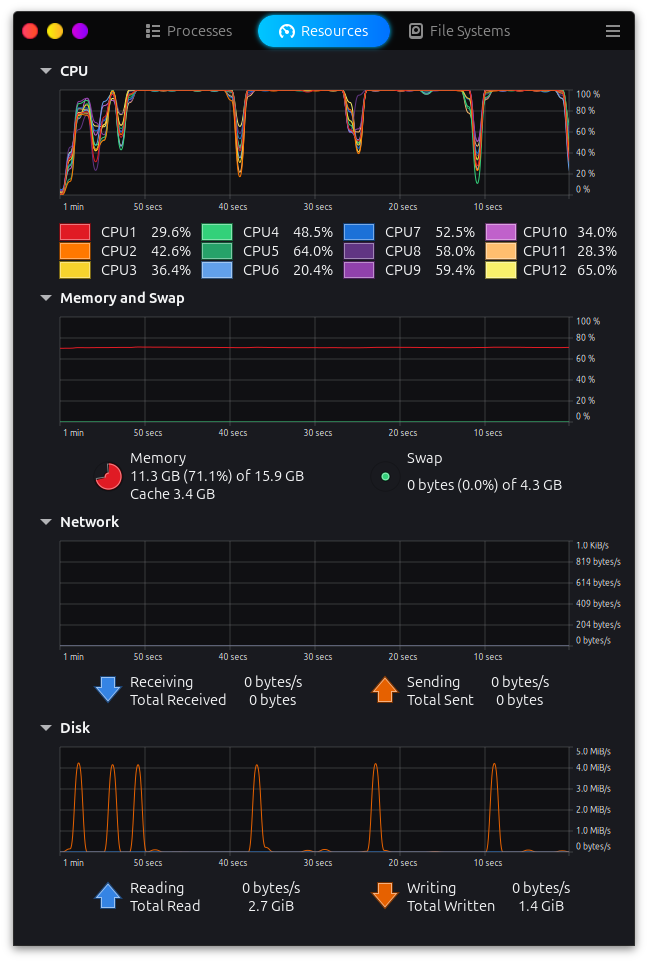

### Deep Learning

- CNN Modelling

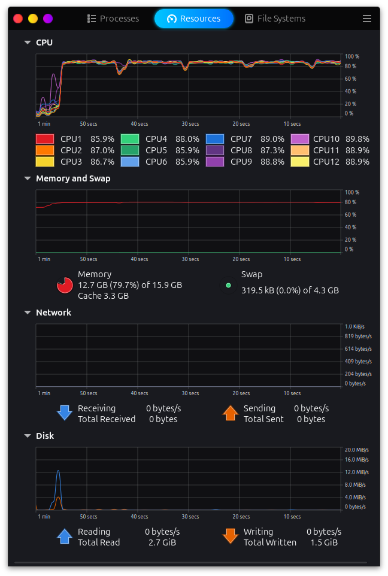

### Explainable AI

- LIME Image Explainer

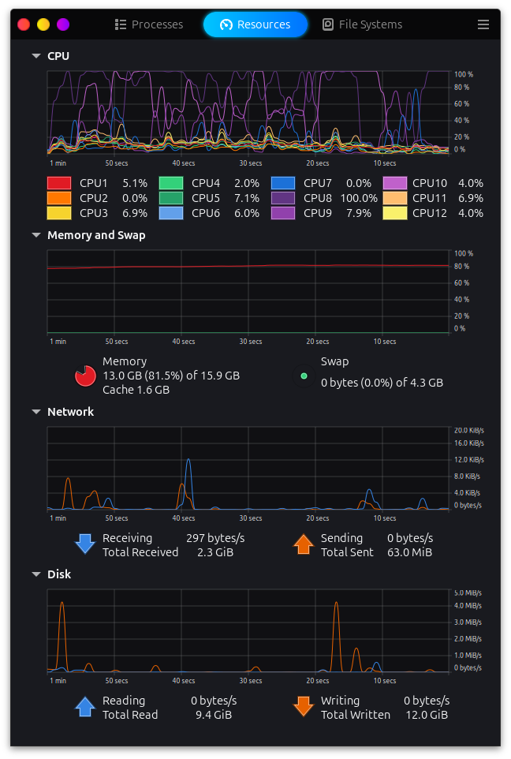
